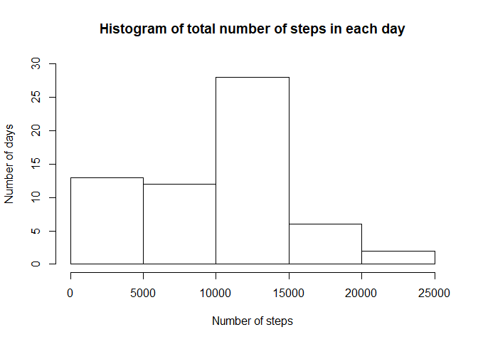
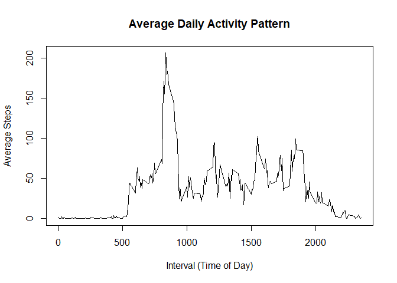
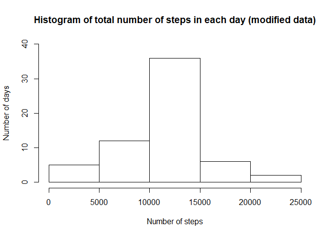
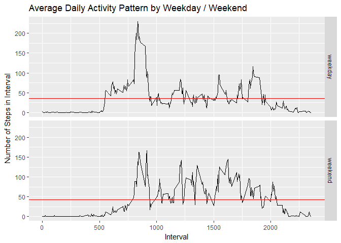

# Reproducible Research: Peer Assessment 1

## Loading and preprocessing the data
The data is unzipped into the activity folder and the results are read into the activity data table using read.csv. The date column is converted to the date type


```r
unzip("activity.zip", exdir = "activity")
activity <- read.csv("./activity/activity.csv")
activity$date <- as.Date(activity$date, "%Y-%m-%d")
```


## What is mean total number of steps taken per day?
This is calculated from the above data, with na.rm = TRUE.


```r
library(dplyr)
steps <- group_by(activity, date) %>%
    summarise(steps = sum(steps, na.rm = TRUE))

# changed to character as Rmarkdown would report results in standard form
calc_mean <- as.character(round(mean(steps$steps), digits = 2))
calc_median <- median(steps$steps)

hist(steps$steps, xlab = "Number of steps", ylab = "Number of days", ylim = c(0, 30), main = "Histogram of total number of steps in each day")
```

<!-- -->

We find that the mean total number of steps taken each day is 9354.23, and the median total number of steps taken each day to be 10395.

## What is the average daily activity pattern?

```r
intervals <- group_by(activity, interval) %>%
    summarise(steps = mean(steps, na.rm = TRUE))

maximum <- intervals[intervals$steps == max(intervals$steps),]

with(intervals, plot(interval, steps, type = "l", xlab = "Interval (Time of Day)", ylab = "Average Steps", main = "Average Daily Activity Pattern"))
```

<!-- -->

The 5 minute interval that contains the maximum number of steps is 835

## Inputing missing values
In this part, we replace the missing NA values at a specific interval with the mean of the steps that happened across the other days at the same interval. This is already captured in the intervals vector.


```r
tot_no <- sum(is.na(activity$steps))

# makes a copy of the activity data frame
activity_new <- activity

# loop to replace NA values with mean of values from the same interval across other days
for (i in 1:nrow(activity_new)) {
    if (is.na(activity_new$steps[i])) {
        temp_interval <- activity_new$interval[i]
        activity_new$steps[i] <- intervals[intervals$interval == temp_interval,2][["steps"]]
    }
}

# summarises the data for plotting and averaging
steps_new <- group_by(activity_new, date) %>%
    summarise(steps = sum(steps))

# changed to character as Rmarkdown would report results in standard form
calc_mean_new <- as.character(round(mean(steps_new$steps), digits = 2))
calc_median_new <- as.character(round(median(steps_new$steps), digits = 2))

# plots histogram
hist(steps_new$steps, xlab = "Number of steps", ylab = "Number of days", ylim = c(0, 40), main = "Histogram of total number of steps in each day (modified data)")
```

<!-- -->

The total number of missing values in the dataset is 2304. The new mean and median are 10766.19 and 10766.19 respectively.

### What has changed with the mean and median
The mean has increased from 9354.23 to 10766.19. This is due to the fact that there were previously days which recorded 0 steps (from NA entries) which now have steps which are filled in using the interval mean matching method described above.

The median has also increased from 10395 to 10766.19. This is also due to the fact that there were days that recorded 0 steps, which now all record the mean number of steps in a day (given that this was the method we chose to fill in the NAs). 

This also explains why the median is now equal to the mean, as there are now 8 days which previously recorded 0 steps, but now have the mean number of steps, and are bunched in the middle (hence being captured as the median).

## Are there differences in activity patterns between weekdays and weekends?

```r
library(ggplot2)

# adds new column to serve as a factor
activity_new$weekday <- ifelse(weekdays(activity_new$date, abbreviate = TRUE) == "Sat" | weekdays(activity_new$date, abbreviate = TRUE) == "Sun", "weekend", "weekday")

# summarises results by interval and type of day
intervals_new <- group_by(activity_new, interval, weekday) %>%
    summarise(steps = mean(steps))

# calculates mean steps walked across intervals, depending on type of day
intervals_new$day_mean <- with(intervals_new, tapply(steps, weekday, mean))

# plots results
ggplot(intervals_new, aes(interval, steps)) + geom_line() + facet_grid(weekday ~ .) + geom_hline(aes(yintercept = day_mean), colour = "red") + labs(x = "Interval", y = "Number of Steps in Interval", title = "Average Daily Activity Pattern by Weekday / Weekend")
```

<!-- -->

From the chart it can be seen that there are a few significant differences between activity patterns during weekdays and weekends.

First, the average number of steps in an interval is higher during weekends than weekdays, indicating more activity is being done over weekends (this can be seen from the position of the red line).

Secondly, there is a peak at around 8am - 9am for weekdays that is much larger than the weekend data, which may be due to the person going to work at the time.

Thirdly, it can be seen that the number of steps is generally higher between 10am - 8pm onwards during the weekends as compared to weekdays. This may be due to the person working in a white collar job and hence not moving around as much.
